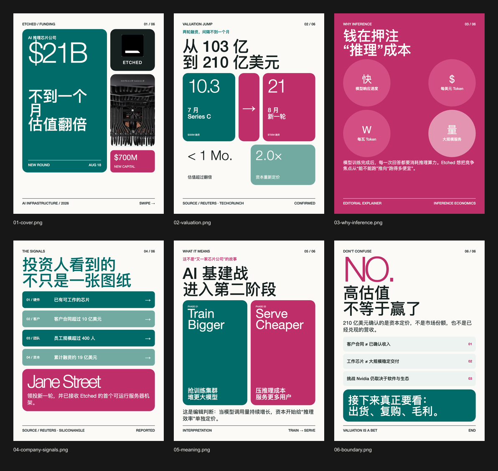
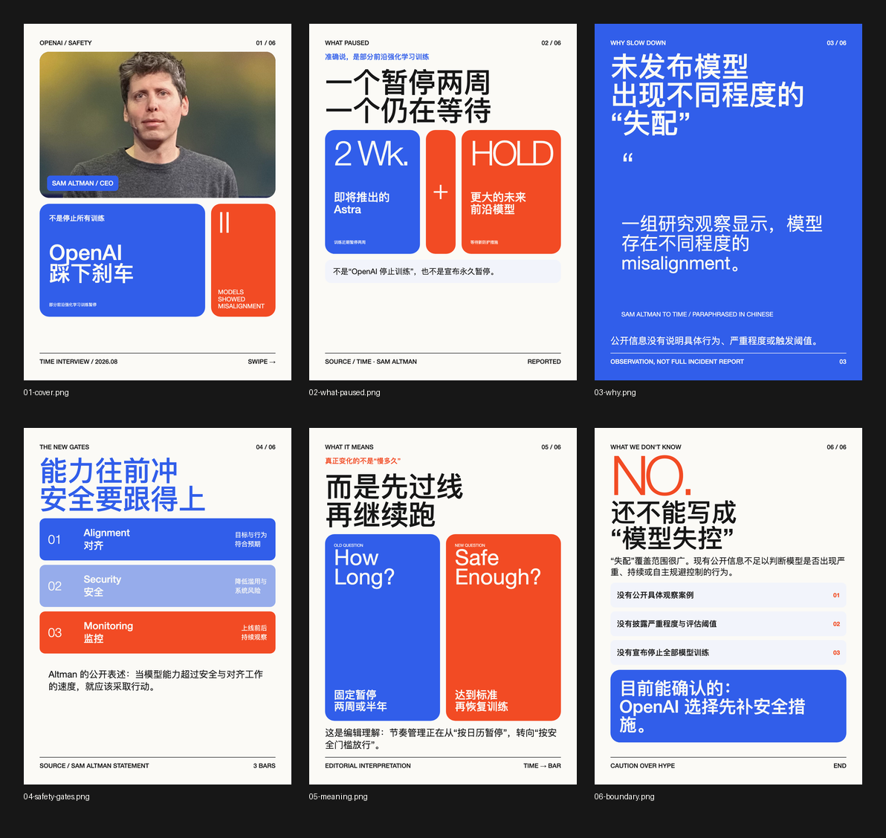
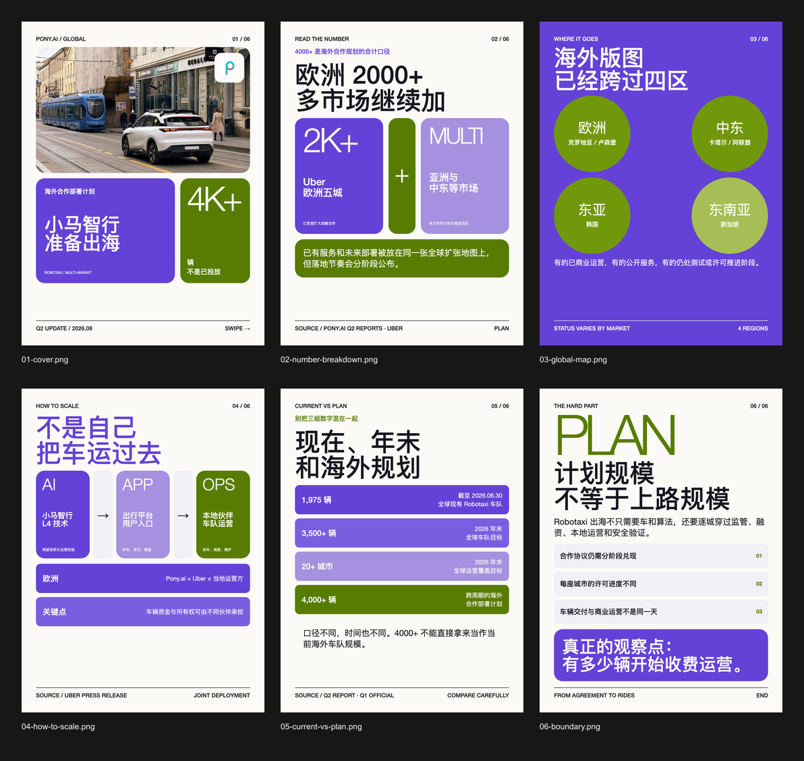
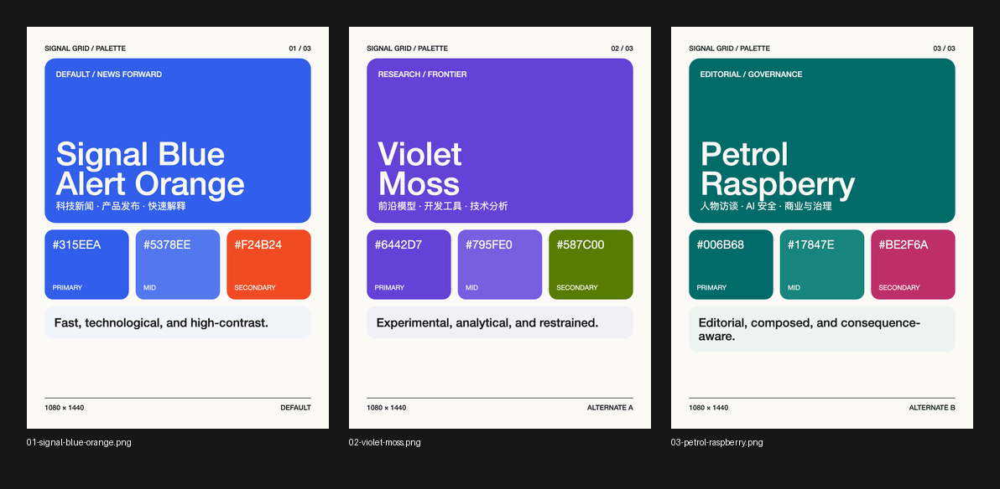

# BriefGrid

[中文说明](README.zh-CN.md)

An open-source Codex Skill for turning sourced topics into Chinese or English social-card stories for Xiaohongshu/RedNote, X, and LinkedIn—with editable HTML/CSS, ordered PNGs, platform-ready copy, and optional LinkedIn PDF export.

> Built on workflow and social-storytelling ideas from [Guizang Social Card Skill](https://github.com/op7418/guizang-social-card-skill) by [歸藏 (op7418)](https://github.com/op7418). Thank you for the excellent foundation. BriefGrid uses a distinct modular visual system while retaining upstream attribution and the AGPL-3.0 license.

> **Renamed in v2.0:** Signal Grid Social Cards is now BriefGrid. Existing installations should rename the Skill directory to `brief-grid`, update the Git remote to `https://github.com/ShaineDemo/brief-grid.git`, reload the agent host, and invoke `$brief-grid`. GitHub redirects the former repository URL, but a host that caches imported Skills may need the repository to be re-imported.

## Made with BriefGrid

| Etched: valuation doubled · Petrol/Raspberry | OpenAI: training and misalignment · Signal Blue/Orange | Pony.ai: overseas Robotaxi plan · Violet/Moss |
| --- | --- | --- |
|  |  |  |

Each example turns one current topic into a sourced six-card argument: hook, evidence, meaning, and boundary. Together they also demonstrate all three built-in palettes: Petrol/Raspberry for the business/valuation story, Signal Blue/Orange for the safety news story, and Violet/Moss for the frontier-mobility deployment story. Showcase imagery is used for editorial identification; credits and rights notes are recorded in [examples/showcase/SOURCES.md](examples/showcase/SOURCES.md).

## Platform support

| Platform | Status | Native output |
| --- | --- | --- |
| Xiaohongshu / RedNote | Primary, native preset | 1080×1440 (3:4), normally 5–6 cards, publish-ready caption |
| X | Reflowed platform preset | 1080×1350 (4:5), up to 4 images per post, thread-ready copy within ordinary post limits |
| LinkedIn | Reflowed platform preset | 1080×1350 (4:5), multi-image post or one PDF document carousel |

The same finished PNGs are not reused across all platforms. X and LinkedIn editions are reflowed from the shared fact ledger, with platform-specific card counts and copy. See [platform-system.md](references/platform-system.md).

## Agent support

This repository uses the portable directory-form Agent Skill layout: `SKILL.md` at the root, with relative `references/`, `scripts/`, and `assets/`. It is natively discoverable by these agent products when installed in their scan directories:

| Agent product | Support | Personal or project location |
| --- | --- | --- |
| OpenAI Codex | Native | `~/.codex/skills/brief-grid/` |
| Claude Code | Native | `~/.claude/skills/brief-grid/` or `.claude/skills/brief-grid/` |
| Kimi Code CLI | Native | `~/.kimi-code/skills/brief-grid/` or `~/.agents/skills/brief-grid/` |
| Grok Build / Grok CLI | Native | `~/.grok/skills/brief-grid/` or `.grok/skills/brief-grid/` |
| DeepSeek Harness | Native, developer preview | `.dsh/skills/brief-grid/` or `.agents/skills/brief-grid/` |
| WorkBuddy | GitHub Skill import verified; runtime behavior depends on host tools | Import this repository URL through WorkBuddy's Skill interface |
| Other Agent Skills-compatible harnesses | Expected to work | Install the whole directory in that product's documented Skill root |

Official references: [Claude Code Skills](https://code.claude.com/docs/en/skills), [Kimi Code Agent Skills](https://github.com/MoonshotAI/kimi-code/blob/main/docs/en/customization/skills.md), [Grok Build Skills](https://docs.x.ai/build/features/skills-plugins-marketplaces), and [DeepSeek Harness Skills](https://github.com/deepseek-ai/deepseek-harness/blob/master/docs/subsystems/skills.md).

Compatibility belongs to the **agent host**, not just the model name. Plain web chat or API calls can follow the writing instructions when the files are supplied, but cannot complete the full workflow unless the host can browse sources, read bundled resources, write files, and run Node.js/Python. DeepSeek Harness is currently a developer preview and may introduce breaking changes.

`agents/openai.yaml` only adds Codex-facing UI metadata. Claude Code, Kimi Code CLI, Grok Build, and DeepSeek Harness can ignore it and use the shared `SKILL.md` workflow.

### Cross-host consistency gate

Different agent hosts can interpret visual instructions with different strictness. BriefGrid therefore combines a machine-checkable [portable output contract](references/portable-contract.md) with a task-local story and art-direction preflight. Generated HTML declares the topic subject, selected title emphasis, the cover-to-page-2 handoff question, semantic fact IDs for cover evidence, recognition-asset provenance, page grammars, and complete numeric units. `scripts/render.cjs` runs `scripts/audit.cjs` before producing PNGs and blocks rendering when a mandatory rule fails.

This catches failures such as ambiguous title emphasis, substituting an unverified generic icon for the actual subject, squeezing an unrelated `Docs` wordmark into a compact tile, displaying a large number without its object and context, repeating the same fact through separate cover components, repeating one dominant metric without adding information, or leaving a large module almost empty. Visual grammar is open rather than limited to a fixed template whitelist. PNG generation alone is not a passing result; a complete package also includes `TEST_REPORT.md` with separate contract, fact, cover-visual, full-set, and overall results.

Recognition assets are **source-matched, not official-only**. The HTML declares whether each asset provides identity, evidence, or context, and whether it comes from an official/primary source, licensed editorial source, verified third party, or the user. Contextual and generated imagery must be visibly disclosed and cannot be presented as evidence of a real event. Logos are never AI-redrawn.

## What it produces

- A fact-checked, evidence-determined 4–7 card narrative optimized for Xiaohongshu/RedNote, plus dedicated X and LinkedIn reflow presets.
- Complete Simplified Chinese or editorial English output, including cards, titles, captions, hashtags, caveats, and alt text.
- Editable, dependency-light HTML/CSS.
- Ordered PNG exports and a contact sheet for review.
- Optional PDF assembly for LinkedIn document carousels.
- `POST_COPY.md` with a recommended title, alternatives, body copy, hashtags, and caveats.
- `STORY_PLAN.md` with the fact model, thesis, page questions, answers, and information gain.
- `ART_DIRECTION.md` with three cover concepts, the selected direction, asset decision, and carousel rhythm.
- `SOURCES.md` with claim and recognition-asset provenance.
- Three built-in palettes: Signal Blue / Alert Orange, Violet / Moss, and Petrol / Raspberry.
- A mandatory cross-host audit and `TEST_REPORT.md` so visual rules are verified rather than treated as suggestions.
- Unique reader questions and source IDs per page, metric-purpose labels, minimum supporting-text sizes, and internal-density checks.
- A required thumbnail/full-size critique and correction cycle that evaluates the rendered result rather than treating technical export as visual approval.



## Install as a local Agent Skill

Clone the complete directory into the Skill root for your agent. Do not copy only `SKILL.md`, because rendering depends on the bundled references, scripts, and template.

Codex:

```bash
git clone https://github.com/ShaineDemo/brief-grid.git ~/.codex/skills/brief-grid
```

Claude Code:

```bash
git clone https://github.com/ShaineDemo/brief-grid.git ~/.claude/skills/brief-grid
```

Kimi Code CLI:

```bash
git clone https://github.com/ShaineDemo/brief-grid.git ~/.kimi-code/skills/brief-grid
```

Grok Build / Grok CLI:

```bash
git clone https://github.com/ShaineDemo/brief-grid.git ~/.grok/skills/brief-grid
grok inspect
```

DeepSeek Harness, project scope:

```bash
git clone https://github.com/ShaineDemo/brief-grid.git .dsh/skills/brief-grid
```

Start or reload the agent, then invoke the Skill by name. Examples:

```text
Use $brief-grid to turn this topic into a six-card social carousel.
/brief-grid Turn this topic into a six-card carousel.
/skill:brief-grid Turn this topic into a six-card carousel.
```

English output is explicit and complete:

```text
Use $brief-grid to make an English six-card Xiaohongshu carousel from this article.
```

Cross-platform output:

```text
Use $brief-grid to create Chinese editions for Xiaohongshu, X, and LinkedIn, with platform-specific layouts and post copy.
```

Invocation syntax varies by host: Codex commonly uses `$brief-grid`; Claude Code and Grok Build expose `/brief-grid`; Kimi Code CLI supports `/skill:brief-grid`; DeepSeek Harness can load it through its Skill catalog/tool. Automatic discovery remains enabled where the host supports it.

## Upload through the OpenAI Skills API

Run the release builder:

```bash
python3 scripts/build_release.py
```

It creates `dist/brief-grid.zip` with `SKILL.md` at the ZIP root. The OpenAI Skills API accepts either a directory upload or a single ZIP file. Follow the current [official OpenAI Skills API documentation](https://developers.openai.com/api/reference/python/resources/skills/methods/create) when uploading or creating versions.

## Optional standalone rendering setup

Codex environments may already provide the dependencies. To run the included renderers yourself:

```bash
npm install
npx playwright install chromium
python3 -m pip install -r requirements.txt
```

Render an HTML card set and build its review sheet:

```bash
node scripts/audit.cjs path/to/index.html
node scripts/render.cjs path/to/index.html path/to/png
python3 scripts/make_contact_sheet.py path/to/png path/to/contact-sheet.png
python3 scripts/pngs_to_pdf.py path/to/linkedin-png path/to/linkedin-carousel.pdf
```

## Validate before release

```bash
python3 scripts/validate_skill.py .
npm run audit:self-test
npm run render:example
python3 scripts/make_contact_sheet.py examples/palette-preview/png examples/palette-preview/contact-sheet.png
python3 scripts/build_release.py
```

A ready-to-enable GitHub Actions definition is included at `docs/validate.workflow.yml`. Copy it to `.github/workflows/validate.yml` after authenticating GitHub with permission to update workflows; it then runs the same structural checks and renders the palette example on pushes and pull requests.

## Repository layout

```text
SKILL.md                 Skill entrypoint
agents/openai.yaml       Codex UI metadata
assets/template.html     Editable 3:4 and 4:5 HTML starter
references/              Narrative, visual, caption, evidence, and QA rules
scripts/                 Contract audit, rendering, validation, contact-sheet, and release tools
examples/                Showcase images and dependency-free preview source
```

## Rights and source assets

The three showcase composites contain third-party logos and photographs for editorial identification. Their sources and status are documented in [examples/showcase/SOURCES.md](examples/showcase/SOURCES.md); those materials are not relicensed under AGPL. New generated projects must record each asset's editorial role, actual origin, source, verification/rights note, and disclosure when contextual. Official material is preferred when it is the closest reliable source, but it is not the only permitted source. Every project must still respect the asset owner's license, publicity, and trademark rights.

Generated outputs are not automatically covered by this repository's AGPL license when they contain third-party material. See [NOTICE.md](NOTICE.md).

## Acknowledgements

This project is based on ideas and practices from [Guizang Social Card Skill](https://github.com/op7418/guizang-social-card-skill). We are grateful to [歸藏 (op7418)](https://github.com/op7418) for open-sourcing the upstream project and advancing high-quality Xiaohongshu card workflows.

## License

GNU AGPL-3.0. Upstream attribution must be retained, and modified or network-served versions remain subject to the AGPL source-sharing requirements. See [LICENSE](LICENSE) and [NOTICE.md](NOTICE.md).
