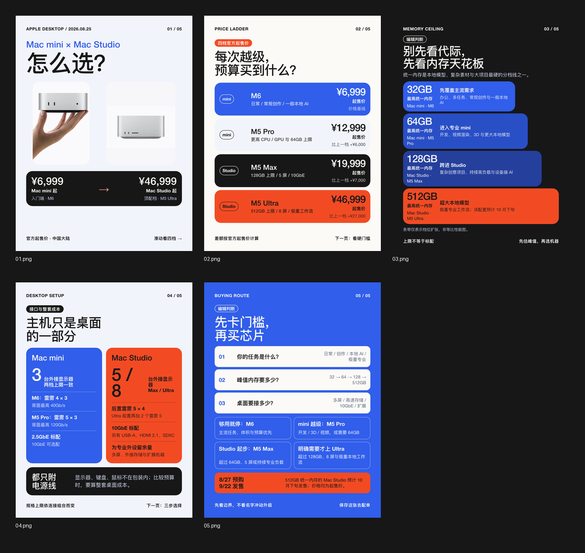

# BriefGrid

[English README](README.md)

一个主要面向小红书 / RedNote，同时适配 X 和 LinkedIn 的开源 Codex Skill。它把有来源的选题制作成中文或英文社交卡片，并产出可编辑 HTML/CSS、有序 PNG、平台发布文案及可选的 LinkedIn PDF。

> 本项目在 [Guizang Social Card Skill](https://github.com/op7418/guizang-social-card-skill) 的工作流与社交叙事实践基础上开发。感谢 [歸藏（op7418）](https://github.com/op7418) 开源这一优秀项目。BriefGrid 采用不同的模块化视觉语言，并保留上游署名及 AGPL-3.0 许可。

> **v2.0 更名说明：** Signal Grid Social Cards 已更名为 BriefGrid。已有安装需要把 Skill 目录改为 `brief-grid`，将 Git 远端更新为 `https://github.com/ShaineDemo/brief-grid.git`，重新加载 Agent，并改用 `$brief-grid` 调用。GitHub 会重定向旧仓库地址，但 WorkBuddy 等会缓存导入内容的宿主可能需要重新导入仓库。

## 用 BriefGrid 制作

| Etched 估值翻倍 · Petrol/Raspberry | Mac mini × Mac Studio 选购指南 · Signal Blue/Orange | 小马智行海外 Robotaxi · Violet/Moss |
| --- | --- | --- |
|  |  |  |

每个案例都把一个时效选题整理成有来源的视觉叙事：钩子、证据、意义和边界。三个案例同时展示全部内置色板：商业与估值选题使用 Petrol/Raspberry，产品对比选题使用 Signal Blue/Orange，前沿出行部署使用 Violet/Moss。展示图中的识别素材仅用于编辑性说明，来源和权利状态记录在 [examples/showcase/SOURCES.md](examples/showcase/SOURCES.md)。

## 平台适配

| 平台 | 状态 | 原生输出 |
| --- | --- | --- |
| 小红书 / RedNote | 首要平台、原生预设 | 1080×1440（3:4），通常 5–6 张，附完整发布文案 |
| X | 专用重排预设 | 1080×1350（4:5），单帖不超过 4 张，提供符合普通帖限制的线程文案 |
| LinkedIn | 专用重排预设 | 1080×1350（4:5），多图帖子或单个 PDF 文档轮播 |

三端不会直接复用同一批成品 PNG。X 和 LinkedIn 版本从同一事实账本重新排版，并分别调整卡片数量和发布文案。详细规则见 [platform-system.md](references/platform-system.md)。

## Agent 产品支持

仓库采用可移植的目录型 Agent Skill 结构：根目录是 `SKILL.md`，并通过相对路径引用 `references/`、`scripts/` 和 `assets/`。放入对应扫描目录后，可被以下产品原生发现：

| Agent 产品 | 支持情况 | 个人或项目目录 |
| --- | --- | --- |
| OpenAI Codex | 原生支持 | `~/.codex/skills/brief-grid/` |
| Claude Code | 原生支持 | `~/.claude/skills/brief-grid/` 或 `.claude/skills/brief-grid/` |
| Kimi Code CLI | 原生支持 | `~/.kimi-code/skills/brief-grid/` 或 `~/.agents/skills/brief-grid/` |
| Grok Build / Grok CLI | 原生支持 | `~/.grok/skills/brief-grid/` 或 `.grok/skills/brief-grid/` |
| DeepSeek Harness | 原生支持，开发者预览 | `.dsh/skills/brief-grid/` 或 `.agents/skills/brief-grid/` |
| WorkBuddy | 已验证可从 GitHub 导入；执行一致性取决于宿主工具 | 通过 WorkBuddy 的 Skill 界面导入本仓库 URL |
| 其他兼容 Agent Skills 的工具 | 预计兼容 | 将完整目录放入产品文档指定的 Skill 根目录 |

官方说明：[Claude Code Skills](https://code.claude.com/docs/en/skills)、[Kimi Code Agent Skills](https://github.com/MoonshotAI/kimi-code/blob/main/docs/en/customization/skills.md)、[Grok Build Skills](https://docs.x.ai/build/features/skills-plugins-marketplaces)、[DeepSeek Harness Skills](https://github.com/deepseek-ai/deepseek-harness/blob/master/docs/subsystems/skills.md)。

兼容性取决于 **Agent 宿主**，不只是模型名称。普通网页聊天或裸 API 在拿到文件后可以执行文案部分，但只有宿主具备联网检索、读取资源、写文件及运行 Node.js/Python 的能力，才能完成 HTML、PNG、总览图和 PDF 的完整生产流程。DeepSeek Harness 当前仍处于开发者预览阶段，后续可能出现破坏性改动。

`agents/openai.yaml` 只提供 Codex 界面元数据；Claude Code、Kimi Code CLI、Grok Build 和 DeepSeek Harness 可以忽略它，共同使用同一份 `SKILL.md` 工作流。

### 跨宿主一致性门禁

不同 Agent 宿主对视觉规范的执行力度不同，因此 BriefGrid 把可机器检查的[跨宿主输出契约](references/portable-contract.md)与任务级故事、艺术指导预案结合起来。生成的 HTML 必须声明准确卡片数和唯一页面结构、选题主体、标题强调角色、封面到第 2 页的交接问题、封面证据事实 ID、识别素材来源、可比较的产品价格口径、性能测试语境、页面语法和完整数字信息单元。`scripts/render.cjs` 会先调用 `scripts/audit.cjs`，存在强制规则错误时不会继续出图。

它会拦截这些问题：标题强调角色含混、用未经核验的通用图标冒充选题主体、把无关的 `Docs` 横向字标塞进紧凑模块、让大数字脱离对象和语境、在封面用不同组件重复同一事实、用同一个大数字重复填充多页，或让大色块几乎没有内容。页面语法保持开放，不再被固定模板白名单限制。仅成功生成 PNG 不代表通过；完整交付还必须包含分别记录合同、事实、封面视觉、整组视觉与总体结论的 `TEST_REPORT.md`。

识别素材采用**来源匹配制，而不是官方素材唯一制**。HTML 会声明每张图承担身份识别、事实证据还是情境说明，并记录它来自官方/一手来源、授权媒体、经核验的第三方或用户提供。情境图和生成图必须显著标注，不能冒充真实事件证据；Logo 不能用 AI 重绘。

## 主要能力

- 根据证据量生成 4–7 张 `1080×1440` 小红书图文卡片，并支持 X、LinkedIn 专用 4:5 重排。
- 支持完整简体中文或英文版本，不是只翻译标题。
- 同时生成可编辑 HTML/CSS、PNG 和总览拼图。
- 可把 LinkedIn 卡片组合成一个 PDF 文档轮播。
- 生成 `POST_COPY.md`：推荐标题、备选标题、发布正文、标签及必要提示。
- 生成 `STORY_PLAN.md`：事实模型、故事判断、逐页问题、答案与信息增量。
- 生成 `ART_DIRECTION.md`：三个封面概念、最终选择、素材决策与整套节奏。
- 生成 `SOURCES.md`：记录新闻事实、Logo、人物照片及其他识别素材的来源。
- 内置 Signal Blue / Alert Orange、Violet / Moss、Petrol / Raspberry 三套色板。
- 内置跨宿主强制审计和 `TEST_REPORT.md`，让关键设计规则成为验收条件，而不是建议。
- 强制每页回答不同问题并绑定来源，标记数字用途，检查辅助字号和大模块内部信息密度。
- 强制进行缩略图与全尺寸两轮视觉批评，记录问题并修正，不能把成功出图等同于设计通过。


未指定语言时默认使用简体中文；明确要求英文时，卡片文字、发布文案、标签、提示和替代文本均使用自然英文，并根据英文长度重新排版。

## 安装

必须安装完整目录，不能只复制 `SKILL.md`，因为渲染流程还需要模板、references 和 scripts。

Codex：

```bash
git clone https://github.com/ShaineDemo/brief-grid.git ~/.codex/skills/brief-grid
```

Claude Code：

```bash
git clone https://github.com/ShaineDemo/brief-grid.git ~/.claude/skills/brief-grid
```

Kimi Code CLI：

```bash
git clone https://github.com/ShaineDemo/brief-grid.git ~/.kimi-code/skills/brief-grid
```

Grok Build / Grok CLI：

```bash
git clone https://github.com/ShaineDemo/brief-grid.git ~/.grok/skills/brief-grid
grok inspect
```

DeepSeek Harness 项目级安装：

```bash
git clone https://github.com/ShaineDemo/brief-grid.git .dsh/skills/brief-grid
```

重新加载 Agent 后按宿主对应方式调用：

```text
使用 $brief-grid 把这个选题做成 6 张小红书图文，并一起生成发布标题和正文。
/brief-grid 把这个选题做成 6 张图文。
/skill:brief-grid 把这个选题做成 6 张图文。
```

英文版本：

```text
Use $brief-grid to make an English six-card Xiaohongshu carousel from this article.
```

多平台版本：

```text
使用 $brief-grid 为这个选题分别制作小红书、X 和 LinkedIn 中文版本，版式和发布文案按平台适配。
```

## 本地渲染与校验

```bash
npm install
npx playwright install chromium
python3 -m pip install -r requirements.txt
python3 scripts/validate_skill.py .
npm run audit:self-test
npm run render:example
python3 scripts/make_contact_sheet.py examples/palette-preview/png examples/palette-preview/contact-sheet.png
python3 scripts/pngs_to_pdf.py path/to/linkedin-png path/to/linkedin-carousel.pdf
python3 scripts/build_release.py
```

仓库提供 `docs/validate.workflow.yml` 作为 GitHub Actions 模板。GitHub 凭证具有 workflow 写入权限后，将它复制到 `.github/workflows/validate.yml` 即可启用自动校验。

## 素材与权利

首页的三张案例合成图包含用于编辑性识别的第三方 Logo 与照片，其来源和权利状态记录在 [examples/showcase/SOURCES.md](examples/showcase/SOURCES.md)，不随 AGPL 重新授权。Skill 在新任务中使用素材时，必须记录素材角色、实际来源、核验/权利说明以及情境图披露。官方素材在它是最接近的一手来源时优先，但不是唯一许可来源；仍需尊重原始许可、肖像权与商标权，不得暗示未经证实的合作或背书。详情见 [NOTICE.md](NOTICE.md)。

## 致谢

本项目基于 [Guizang Social Card Skill](https://github.com/op7418/guizang-social-card-skill) 的工作流与社交叙事实践继续设计。再次感谢 [歸藏（op7418）](https://github.com/op7418) 的开源贡献。

## 许可证

GNU AGPL-3.0。必须保留上游署名；修改、分发或以网络服务形式提供时，需要遵守 AGPL 的源码开放要求。完整条款见 [LICENSE](LICENSE) 与 [NOTICE.md](NOTICE.md)。
